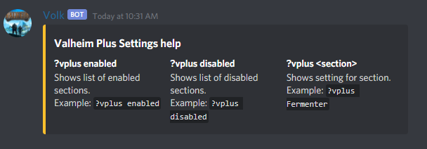

# Optional Addons
Optional commands for the bot

## Pluscmds:
### Info:
`plussettingstodb.py` Will make a new table in the MySQL database and load the contents from `vplusfile` setting in `config.py` to the table.  If the table exist it will delete the table and remake it  

`pluscmds.py` Is bot commands for displaying Valheim Plus setting from the table created by `plussettingstodb.py`

### Setup:
Move `plussettingstodb.py` to the `code` dir    
Move `pluscmds.py` to the `code/botcmds` dir  

### Usage:
`python3 plussettingstodb.py` While in the `code` dir. Script will run and exit when finished.  **NOTE:** This will have to be done every time you make a change to the Valheim Plus configuration file.  

After moving the `pluscmds.py` restart the bot. This only needs to be done once, you can run `plussettingstodb.py` at anytime without having to restart the bot.

### Example Output:
## Pluscmds:

